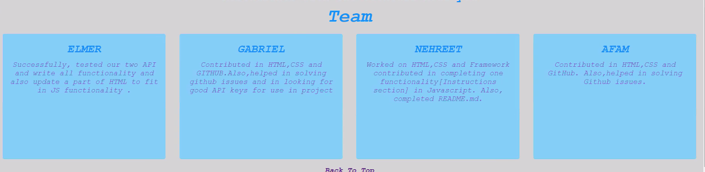

# Cocktail-on-the-run

# User Story
As a user, you can enter **Cocktail Name** 

And as a result, you get the **Ingredients** and **Instructions**
shown on web-page with the nearest **Bars**.

# Acceptance Criteria

Given a **Cocktail-Website** with **Search-Box**

When I enter any **Cocktail-Name** in the ssearch-box

Then I am presented with **Ingredients** and **Instructions**

of the entered **Cocktail-Drink**.

When I click, on the **Button Provided**

get the recommendations of **nearest Bars** according

to my **location**

## The following images shows the functionality of the application

## Output
User is presented with the **nice** image of drinks
When a user, **Hover** on the **Search-Icon**,

**serach-box** expands and user can enter any Cocktail-Drink

name in the search-box. Afterwords, user is presented with
**Coctail** **Ingredients** and **Instructions** to follow
in order, to make that **Coctail**.
When a user, click on the provided **Button** , will
get the **Recommendations** for the nearest **Bars** 
according to their **location** . Achieved this **functionality**
with the use of **Two** **API**. 

# Text-Editor

  Vs-Code

  # Language Used

  **HTML**

  **CSS**

  **Java-script**

  **J-Query**

# Frame-work 

**Flex-box**

# API Referred

[Coctail-API](https://www.thecocktaildb.com)

[Yelp-API]("https://yelp-com.p.rapidapi.com)

## Resources Reffered

[Stack-overflow](https://stackoverflow.com/)

[Flex-box](https://css-tricks.com/snippets/css/a-guide-to-flexbox/)

[Font Awesome](https://fontawesome.com/icons?d=gallery&q=search&m=free)

# Links

[Github-repo](https://github.com/Afam-26/Cocktail-on-the-run)

[Github-Deployed-Application](https://afam-26.github.io/Cocktail-on-the-run/)

# Project-TEAM

**Elmer Hernandez**

**Gabriel Gonzales**

**Nehreet Kaur**

**Afamefuna Anekeh**